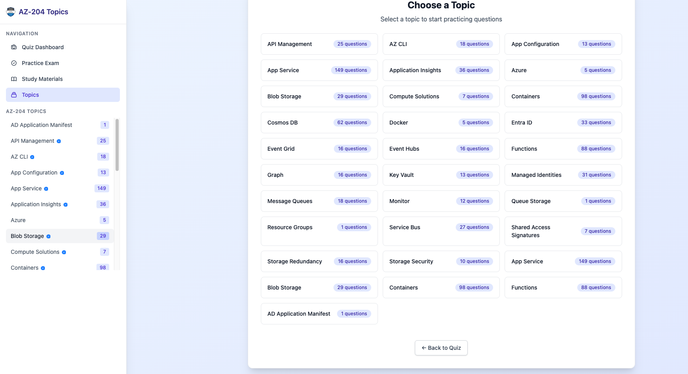

# AZ-204 Quiz App 🎯

A comprehensive quiz application for Microsoft Azure Developer Associate (AZ-204) certification preparation. Built with React Router 7, TypeScript, and modern web technologies.

> **Special Thanks**: This quiz app is built upon the excellent AZ-204 study materials repository. We extend our gratitude to the original creators for their comprehensive Azure documentation and study guides that form the foundation of our learning content.

## 🌟 Features

### 📝 Interactive Quiz System
- **Smart Questions**: 500+ carefully curated AZ-204 exam questions
- **Instant Feedback**: Immediate explanations for correct and incorrect answers
- **Topic-Based Learning**: Organized by Azure service categories
- **Exam Simulation**: Full timed exam mode with 54 questions
- **Code Syntax Highlighting**: Beautiful syntax highlighting for code examples
- **Markdown Support**: Rich content formatting for questions and explanations

### 📚 Comprehensive Study Materials
- **23 Study Topics**: Complete coverage of all AZ-204 exam domains
- **Rich Content**: Converted from comprehensive markdown documentation
- **Progress Tracking**: Mark sections as completed and track your learning journey
- **Personal Notes**: Add your own insights and reminders to any study material
- **Search & Filter**: Find specific topics by difficulty, tags, or keywords
- **Section Navigation**: Easy browsing with estimated read times
- **Related Topics**: Discover connected Azure services and concepts

### 🎨 Modern User Experience
- **Responsive Design**: Works seamlessly on desktop, tablet, and mobile devices
- **Beautiful UI**: Clean, modern interface with Tailwind CSS
- **Fast Performance**: Built with Vite for lightning-fast development and builds
- **Local Storage**: Your progress and notes are saved locally
- **Accessibility**: WCAG compliant design for all users

## 📸 Screenshots

### Home Screen

*Clean, intuitive home screen with easy navigation to quiz and study materials*

### Study Materials

*Comprehensive study materials with progress tracking and note-taking capabilities*

### Choose Topics

*Topic-based learning with difficulty indicators and progress tracking*

### Practice Exam

*Full exam simulation with timer and comprehensive feedback*

## 🚀 Quick Start

### Prerequisites
- Node.js (v18 or higher)
- npm package manager
- Make (for build automation)

### Installation & Setup
```bash
# Clone and setup the project
git clone <repository-url>
cd quiz-app

# Complete setup (install dependencies + seed database)
make setup

# Start development server
make dev
```

The application will be available at `http://localhost:5173` (or next available port).

## 📋 Available Commands

### Development
```bash
make dev           # Start development server
make work          # Complete development workflow (install + seed + dev)
make dev-clean     # Clean, seed, and start development
```

### Data Management
```bash
make seed          # Seed database with questions
make reset-data    # Reset and reseed database
make convert-study-materials  # Convert markdown to study materials
```

### Code Quality
```bash
make lint          # Run linter
make format        # Format code
make typecheck     # TypeScript type checking
make check         # Run all quality checks
make fix           # Format and auto-fix issues
make pre-commit    # Run pre-commit checks
```

### Build & Production
```bash
make build         # Production build
make build-clean   # Clean and build
make start         # Start production server
make preview       # Build and start production preview
```

### Maintenance
```bash
make clean         # Clean build artifacts
make clean-all     # Deep clean including node_modules
make update        # Update dependencies
make audit         # Security audit
make maintenance   # Complete maintenance cycle
```

### Information
```bash
make help          # Show all available commands
make info          # Show project information
make status        # Show project status
```

## 📁 Project Structure

```
quiz-app/
├── app/                    # Application source code
│   ├── components/         # Reusable React components
│   ├── lib/               # Utility libraries
│   ├── routes/            # Route components and API endpoints
│   ├── styles/            # Stylesheets
│   └── types/             # TypeScript type definitions
├── tools/                 # Development tools and scripts
│   └── scripts/           # Build and data processing scripts
├── public/                # Static assets
├── build/                 # Production build output (generated)
├── docs/                  # Project documentation
├── Makefile              # Build automation
└── package.json          # Dependencies and scripts
```

## 🛠️ Technology Stack

### Frontend Framework
- **React Router 7.6.1**: Modern file-based routing with SSR capabilities
- **TypeScript 5.8.3**: Type-safe development with excellent IDE support
- **Tailwind CSS 4.1.8**: Utility-first CSS framework for rapid UI development

### Build & Development
- **Vite**: Lightning-fast build tool and development server
- **Biome**: Fast code formatter and linter
- **PostCSS**: CSS processing and optimization

### Features & Libraries
- **Syntax Highlighting**: Beautiful code examples with language support
- **Markdown Processing**: Rich content rendering for study materials
- **Local Storage**: Progress tracking and note persistence
- **Responsive Design**: Mobile-first approach with fluid layouts

## 📖 Study Materials Content

Our study materials are automatically generated from comprehensive markdown files covering all AZ-204 exam domains:

### Azure Compute Solutions (25-30%)
- **Azure Functions**: Serverless computing, triggers, bindings, and hosting plans
- **App Service**: Web apps, deployment slots, scaling, and configuration
- **Container Solutions**: Azure Container Registry, Container Instances, and Container Apps

### Azure Storage Solutions (15-20%)
- **Blob Storage**: Storage accounts, containers, access tiers, and lifecycle management
- **Cosmos DB**: NoSQL database, consistency levels, and global distribution
- **Queue Storage**: Message queues and storage patterns

### Azure Security & Identity (20-25%)
- **Key Vault**: Secrets, keys, certificates management
- **Entra ID**: Identity and access management
- **Managed Identities**: Service-to-service authentication

### Integration & Messaging (10-15%)
- **Event Grid**: Event-driven architectures and custom events
- **Event Hub**: Big data streaming and real-time analytics
- **Service Bus**: Enterprise messaging and communication patterns

### Monitoring & Optimization (15-20%)
- **Application Insights**: Performance monitoring and diagnostics
- **Azure Monitor**: Logging, metrics, and alerting
- **Performance Optimization**: Best practices and troubleshooting

Each study material includes:
- **Learning Objectives**: Clear goals for each topic
- **Prerequisites**: Required knowledge before starting
- **Comprehensive Sections**: Detailed explanations with code examples
- **Related Topics**: Connected Azure services and concepts
- **Official Documentation**: Direct links to Microsoft Learn resources

## 🎯 Usage Guide

### Quiz Features
1. **Topic Selection**: Choose from 30+ Azure service topics
2. **Question Navigation**: Previous/Next navigation with progress tracking
3. **Answer Submission**: Submit answers to reveal correct solutions
4. **Detailed Explanations**: Comprehensive rationales and reference links
5. **Multiple Answer Support**: Questions with multiple correct answers

### Study Mode
- Browse organized study materials by topic
- Comprehensive guides for each Azure service
- Code examples and implementation details

### Exam Mode
- Timed 130-minute exam simulation
- 54 questions covering all AZ-204 domains
- Results summary with performance breakdown

## 🔧 Development

### Local Development
```bash
# Start development with hot reload
make dev

# Run with fresh data
make dev-clean
```

### Adding New Questions
1. Add markdown files to the questions directory
2. Run `make seed` to process and import questions
3. Questions automatically categorized by topic

### Code Quality
The project uses Biome for consistent code formatting and linting:
```bash
make fix           # Auto-format and fix issues
make validate      # Check code quality
```

### Database Management
Questions are stored in SQLite and seeded from markdown files:
```bash
make reset-data    # Reset database with latest questions
make seed          # Reseed without clearing existing data
```

## 📊 Performance

- **Optimized Bundle**: Tree-shaking and code splitting
- **Fast Development**: Vite's hot module replacement
- **Responsive Design**: Mobile-first approach
- **Efficient Rendering**: Optimized React component structure

## 🔒 Security

- Regular dependency audits with `make audit`
- No sensitive data in client-side code
- Content Security Policy headers
- Safe markdown rendering

## 📚 Documentation

- [Development Guide](docs/DEVELOPMENT.md) - Comprehensive development instructions
- [Project Structure](docs/PROJECT_STRUCTURE.md) - Detailed folder organization

## 🌟 Feature Showcase

### Study Materials Dashboard
Navigate through 23 comprehensive study topics with progress indicators, difficulty levels, and estimated read times. Each topic includes detailed sections covering:
- Core concepts and fundamentals
- Practical implementation examples
- Best practices and troubleshooting
- Code samples with syntax highlighting
- Official Microsoft documentation links

### Interactive Quiz Experience
Practice with realistic exam questions that include:
- Multiple choice questions with detailed explanations
- Code snippets and scenario-based problems
- Immediate feedback with learning insights
- Topic-specific practice sessions
- Full exam simulation with timing

### Personal Learning Assistant
- **Progress Tracking**: Visual indicators show completion status for each study section
- **Note-Taking**: Add personal insights, tips, and reminders to any content
- **Smart Search**: Find specific information across all study materials instantly
- **Related Topics**: Discover connected Azure services and deepen understanding
- **Bookmarking**: Save important sections for quick reference

### Mobile-Optimized Experience
Seamlessly study anywhere with our responsive design:
- Touch-friendly interface for tablets and phones
- Optimized reading experience with proper typography
- Fast loading times and smooth navigation
- Offline-capable with local storage

## 🎓 Learning Path

1. **Start with Study Materials**: Browse topics and read comprehensive guides
2. **Practice by Topic**: Use topic-specific quizzes to test understanding
3. **Take Notes**: Add personal insights and create your study journal
4. **Track Progress**: Monitor completion and identify areas for review
5. **Simulate Exam**: Take full practice exams under timed conditions
6. **Review & Repeat**: Use analytics to focus on weak areas

## 🤝 Contributing

We welcome contributions to improve the learning experience:

1. **Study Content**: Suggest improvements to study materials
2. **Quiz Questions**: Submit new questions with detailed explanations
3. **Features**: Propose new learning features or UI improvements
4. **Bug Reports**: Help us identify and fix issues

## 🔗 Related Resources

- **Original Study Materials**: [AZ-204 Repository](../)
- **Microsoft Learn**: [AZ-204 Learning Path](https://learn.microsoft.com/en-us/certifications/exams/az-204)
- **Azure Documentation**: [Azure Developer Documentation](https://docs.microsoft.com/en-us/azure/)
- **Practice Tests**: Additional practice resources and mock exams

---

*Transform your AZ-204 study experience with our comprehensive quiz app! 🚀*
